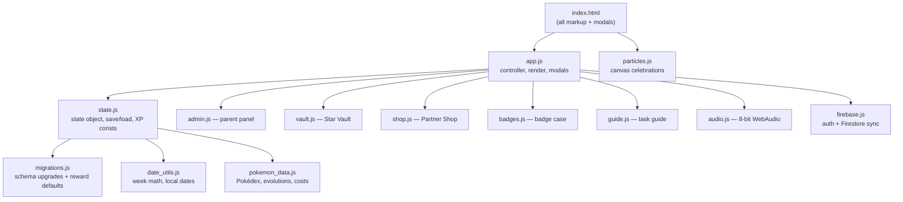

# AGENTS.md — Kepler's Pokémon Training Chart

Instructions for AI coding agents working in this repo. Read this before touching
any file.

**What this is:** a gamified weekly chore/behavior chart for two kids (Kepler, 7;
Lyra, 5), themed as Pokémon training. Plain ES6 modules, no bundler, no framework,
no npm build. It is served as static files and installs as a PWA.

**Repo root:** `/usr/local/google/home/crsjain/kepler-pokemon-chart`
Verify with `pwd` before editing. Working branch: `prototype/pokemon-badge-collection`.

---

## 0. Session start protocol

Run this **only** when the user asks to start, initialize, or resume a session.
Skip it for one-off questions and follow-up turns.

Work through it autonomously. **Self-heal** anything in the first list without
asking. **Stop and ask** only for a hard gate.

### Self-heal — fix these silently, then report in one line each

1. **Location.** Confirm the working directory is
   `/usr/local/google/home/crsjain/kepler-pokemon-chart`. If a command lands
   elsewhere, use absolute paths rather than guessing.
2. **Load-check against this manifest.** These should be in your context
   automatically. For each one that is *not*, read it with `view_file` now.
   Discovery can fail silently, so never assume — check, then fall back.

   | Expected | Fallback if absent |
   | :--- | :--- |
   | `_agents/AGENTS.md` (this file) | read it |
   | `_agents/rules/ux-guidelines.md` | read it in full before any UI work |
   | `_agents/skills/feature-review-panel/SKILL.md` | note the path; read on demand |

3. **Branch.** Run `git branch --show-current`. If it is not
   `prototype/pokemon-badge-collection` **and** `git status --porcelain` is
   empty, switch with `git checkout prototype/pokemon-badge-collection` and say
   so. If the tree is dirty, that is a hard gate.
4. **Checkpoint.** `ls docs/checkpoint_*.md | sort -V | tail -1`. Parse the
   number as an integer. If it is below 55 the sort misfired — re-derive by
   extracting integers and taking the max. Read the winner with `view_file`.
5. **Local server.** The headless suite does *not* start one.
   `curl -s -o /dev/null -w '%{http_code}' http://127.0.0.1:8000/index.html`
   If that is not `200`, start `python3 -m http.server 8000` in the background
   before testing.
6. **Test numbering audit.** `grep` is blocked as a shell command here, so use:
   ```bash
   node -e "const m=[...require('fs').readFileSync('tests.js','utf8').matchAll(/Running Test Case (\d+)/g)].map(x=>+x[1]);const s=[...m].sort((a,b)=>a-b);const d=[...new Set(s.filter((v,i)=>s[i+1]===v))];console.log('blocks:'+m.length,'unique:'+new Set(m).size,'dupes:'+(d.join(',')||'none'))"
   ```
   `dupes:12` is expected. Any other duplicate is a defect — report it, don't fix
   it unasked.
7. **Test suite.** `node run_headless_tests.js`. Expect 100% green in ~17–25s.

### Hard gates — stop and ask

- The checkpoint number is still below 55 after re-deriving.
- The working tree has changes you did not make (report them; never stash,
  revert, or commit them on your own).
- The branch is wrong *and* the tree is dirty.
- The test suite fails, hangs, or exceeds ~60s. Report the failing test; do not
  start fixing unless asked.
- Any manifest file above is missing from disk entirely.

### Then report

- 📌 Branch, checkpoint number loaded, tree clean or dirty
- 🧪 Test result (pass count + wall-clock)
- 🔧 Anything you self-healed (or "nothing")
- 📑 Top 2–3 items from the checkpoint's **Known Follow-ups** (say "none listed"
  rather than inferring)
- 🚀 Suggested first task

---

## 1. Start every session from the latest checkpoint

`docs/` holds numbered checkpoints that are the real project memory — far more
current than this file or the README.

```bash
ls docs/checkpoint_*.md | sort -V | tail -1
```

> [!IMPORTANT]
> Use **numeric** sort (`sort -V`). Lexical sort (`ls | tail -1`) wrongly returns
> `checkpoint_9.md`. If the number you load is below 55, the sort misfired — stop
> and ask.

Read it with `view_file`, then report the checkpoint number you loaded. Each
checkpoint carries: outstanding requests, **Known Follow-ups**, the active state
schema version, the current cache/asset versions, and validation steps.

Older context also lives in `.gemini/handoffs/` (two session handoff docs,
including the Sept 2026 "do not refactor" assessment).

### Reference documents

Checkpoints tell you *what changed last*. These tell you *why a subsystem works
the way it does*. Read the relevant one before modifying its area — they encode
decisions that are expensive to rediscover.

| Doc (`docs/`) | Covers |
| :--- | :--- |
| `prd_star_vault.md` | Star Vault & streak economy (yellow→silver→blue→prism tiers) |
| `prd_badge_collection.md` | Weekly Gym Badge collection and the badge case |
| `prd_historical_weeks.md` | Adaptive week scheduling, modal design system, grid state spec (v3.0) |
| `plan_historical_weeks.md` | Implementation plan for dynamic week boundaries & archiving (v2.1) |
| `prd_column_state_machine.md` | The 8-state column state machine & visual hierarchy |
| `plan_header_refactoring.md` | Refactoring plan behind that state machine |
| `prd_rest_day_passes_and_bonus_tasks.md` | Rest passes 💤, bonus tasks ✨, Great Ball, icon states |
| `prd_parent_past_day_approval.md` | Parent approval + timed grace window for past-day edits |
| `prd_legendary_evolutions.md` | Mega and branching evolutions (Eevee, Onix→Steelix) |
| `prd_alternating_activity_pairs.md` | Alternating activity pairs & dynamic schedule swapping |
| `prd_kindness_quests.md` | Kindness Quests & partner berry feeding |
| `prd_admin_panel_redesign.md` | **Seed, v0.1.0** — parent admin left-nav redesign, not yet specced |
| `refactoring_assessment_2026_09_12.md` | Why the codebase is deliberately *not* being refactored |

Manual/verification guides: `test_plan_pokemon_shop_evolutions.md`,
`test_plan_rest_day_passes_and_bonus_tasks.md`,
`test_plan_unearned_badge_and_reward_carryover.md`,
`manual_test_guide_adaptive_weeks.md`.

UX rules live separately in `_agents/rules/ux-guidelines.md` (see §6.3).


---

## 2. Do not blind-read the large files

This repo has a few files big enough to blow a context window. Always grep or
read line ranges; never dump them whole.

| File | Lines | Notes |
| :--- | ---: | :--- |
| `tests.js` | 7,396 | The entire regression suite. **Never read whole.** |
| `style.css` | 6,183 | All styling. Grep by class name. |
| `app.js` | 4,479 | Main controller. Grep by function name. |
| `pokemon_data.js` | 1,084 | Static Pokédex tables. |
| `index.html` | 902 | Single page, all modal markup inline. |
| `firebase-debug.log` | ~15 MB | **Never read.** Gitignored emulator noise. |
| `firestore-debug.log` | ~3 MB | **Never read.** Gitignored emulator noise. |

---

## 3. Architecture

Native ES6 modules loaded directly by the browser. `index.html` pulls in exactly
two scripts: `particles.js` (classic) and `app.js` (`type="module"`), which imports
everything else.



Key entry points:

- [`app.js`](file:///usr/local/google/home/crsjain/kepler-pokemon-chart/app.js) —
  bootstraps the app, renders the weekly grid, owns the column state machine and
  all modal helpers. Exports [`showCustomConfirm`](file:///usr/local/google/home/crsjain/kepler-pokemon-chart/app.js#L1061)
  and [`showCustomNotification`](file:///usr/local/google/home/crsjain/kepler-pokemon-chart/app.js#L1133).
- [`state.js`](file:///usr/local/google/home/crsjain/kepler-pokemon-chart/state.js) —
  the single `state` object, `saveState` / `loadState`, `runStateDiagnostics`, and
  the XP constants (`XP_PER_TASK` 5, `XP_DAILY_BONUS` 15, `XP_BONUS_TASK` 10,
  `XP_LEVEL_THRESHOLD` 100). `ADMIN_PASSWORD` is `"zxcv"`.
- [`migrations.js`](file:///usr/local/google/home/crsjain/kepler-pokemon-chart/migrations.js) —
  versioned schema migrations. Current schema is **V18**; the full shape is printed
  in the latest checkpoint. Any new persisted field needs a migration here.
- [`date_utils.js`](file:///usr/local/google/home/crsjain/kepler-pokemon-chart/date_utils.js) —
  all week-boundary math. Grid keys are `"YYYY-MM-DD-task"`; never build date
  strings by hand, use `formatLocalDate`.
- [`firebase.js`](file:///usr/local/google/home/crsjain/kepler-pokemon-chart/firebase.js) —
  imports the Firebase SDK from `gstatic.com` CDN at runtime (no npm dependency).

Persistence is localStorage first, with optional Firestore sync. There is **no
package.json and no build step** — what you edit is what ships.

---

## 4. Running it

**Static server** (required for both manual testing and the headless suite):

```bash
python3 -m http.server 8000
```

Then http://crsjain.c.googlers.com:8000/ (or `localhost:8000`). Admin password `zxcv`.

**Firebase emulator** (only needed for auth/Firestore work):

```bash
./run_emulator.sh    # firebase emulators:start, imports/exports ./emulator_data
```

Ports: auth `9099`, firestore `8080`, emulator UI `4000`. There is also a Jetski
sidecar at `.agents/sidecars/firebase_emulator/` that runs this automatically.

**Useful URL flags:** `?runTests=true` (loads `tests.js` and runs the suite),
`?headless=true` (skips service-worker registration), `?exposeState=true` (puts
state helpers on `window`), `?runMigrationTest=true`.

---

## 5. Testing — run it after every change

```bash
node run_headless_tests.js
```

~17–25s wall clock; Chrome launch and sprite fetches dominate. Must be **100%
green** before you report done. Flag it only if it exceeds ~60s or hangs.

> [!WARNING]
> `run_headless_tests.js` does **not** start a web server. It launches headless
> Chrome and navigates to `http://127.0.0.1:8000/index.html?runTests=true&headless=true`.
> If `python3 -m http.server 8000` is not already running, the suite fails with a
> navigation error and a screenshot, not a useful test failure.

How it works: CDP over `localhost:9223`, sprite requests to
`raw.githubusercontent.com` are intercepted and stubbed with a 1×1 GIF, and the
harness watches the browser console for `All regression tests passed successfully!`
(exit 0) versus `Test Suite Failed` / `Assert Failed` / any uncaught exception
(exit 1). Internal watchdog is 60s.

Other harnesses: `node run_migration_test.js`, `node run_verify_all.js`,
`node run_cleanup_all.js`.

### Test numbering discipline

Test numbers must stay unique. Use the node audit in §0 step 6 — `grep` is
blocked as a shell command in this environment, so the old
`grep -oE … | uniq -d` pipeline will not run.

Counts drift as tests are added, so don't hardcode them — run the audit.
The durable invariant is that
`12` is the **only** expected duplicate (`Test Case 12` / `12 part 2` — one
migration feature split into two phases). Anything else printed by that command is
a bug. Numbers **40, 43, 44** are deliberate historical gaps — do not backfill them;
older checkpoints may still reference the deleted tests. New tests take the next
number above the current max.

> [!IMPORTANT]
> Before renumbering or renaming a test, grep `docs/` and let the existing
> documentation decide which test keeps the original number. In the Checkpoint 55
> audit the doc-pinned test was the *second* occurrence in the file — the naive
> "rename the later duplicate" rule would have broken a reference in
> `plan_historical_weeks.md`.

---

## 6. Non-negotiable invariants

### 6.1 Cache busting on every JS/CSS edit

Both of these, every time, or the kids' tablets serve stale code from the service
worker:

1. Bump `CACHE_NAME` in [`service-worker.js`](file:///usr/local/google/home/crsjain/kepler-pokemon-chart/service-worker.js#L1)
   — currently `poke-chart-cache-v160`.
2. Bump the `?v=` query strings in `index.html` — currently `style.css?v=10.53`,
   `app.js?v=10.45`, `particles.js?v=10.3`.

If you add a new module file, also add it to `ASSETS_TO_CACHE` in the service worker.

### 6.2 No native dialogs in app code

Never use `alert()`, `confirm()`, or `prompt()` in application code. Use
`showCustomConfirm()` / `showCustomNotification()` with `.schedule-hero-card`
layouts. **Exception:** `tests.js` may call `alert()` for suite reporting — leave
it alone.

### 6.3 UX rules are binding

Read [`_agents/rules/ux-guidelines.md`](file:///usr/local/google/home/crsjain/kepler-pokemon-chart/_agents/rules/ux-guidelines.md)
before any UI work. 18 numbered rules covering the column state machine's
chromatic archetypes, the checkbox/Pokéball/Great Ball state matrix, contrast
invariants (dark charcoal `#1e293b` on Pikachu yellow `#ffcb05`, never white),
zero inline styles on modals, floating dock ergonomics, and the daily-total
readability rules.

Two that get violated most often:

- **No fractional text in the Daily Total row.** A 7-year-old gets icons only
  (`🌟` / `☆` / `❌` / `➖`); counts live in `title` attributes for parents.
- **Zero inline `style="..."`** on modal wrappers, filter bars, or grids. All
  layout belongs in `style.css`.

### 6.4 Grep before you rename or delete

- Before renumbering, renaming, or deleting anything referenced elsewhere, grep
  `docs/` first and let existing documentation decide which name wins.
- When removing a feature, grep the whole repo for every removed class, ID, and
  symbol to prove nothing is orphaned. Checkpoint 55's revert is the model: markup,
  JS state, CSS rules, README bullet, and a repurposed regression test that asserts
  the removed IDs are *absent*.

---

### 6.5 Which skill to use

| Situation | Use | Notes |
| :--- | :--- | :--- |
| Proposing a feature, UI change, or game mechanic | **`feature-review-panel`** | 5-stage funnel. Skip it for typos, one-line fixes, and doc-only edits. |
| Pressure-testing a PRD in `docs/` | **`feature-review-panel`** | Same panel — Stage 1–3 carry most of the value for a PRD. |
| Ending a work session | **`pokemon-session-wrapup`** | Cache check → tests → README → checkpoint → commit → merge to `main`. **The only sanctioned way to push.** |
| Trying something throwaway | *No skill* — just commit locally | Your dev branch is already the safe space; `git checkout -- .` discards. |

Both live in `_agents/skills/`, so they load only in this workspace.

> [!NOTE]
> **Retired 2026-09-23** — moved to `~/.gemini/config/skills/_archived/` (two
> levels deep, so outside the one-level discovery scan). Don't reinstate without
> fixing the underlying problem:
>
> - **`sandbox-prototype`** — hardcoded `git checkout main` and merged there.
>   `main` is the production/deploy branch, so it would have pushed experiments
>   live, bypassing `prototype/pokemon-badge-collection`.
> - **`prd-review-panel`** — a Google Launch Cal simulator (Legal/Privacy/
>   Security/Buganizer). Wrong domain for a family chore chart, and it read a
>   `context-library/` directory that doesn't exist. It also competed with
>   `feature-review-panel` for the same requests.
> - **global `session-wrapup`** — superseded by the repo-scoped copy. The old one
>   asked the user to run tests manually in a browser and picked the next
>   checkpoint number by lexical sort, which could overwrite an existing file.


---

## 7. Git policy

- Work on `prototype/pokemon-badge-collection`. Confirm with
  `git branch --show-current` before starting.
- Commit locally as you go. **Never push mid-session.**
- Pushing and the merge to `main` (which deploys GitHub Pages) happen only via the
  `pokemon-session-wrapup` skill at the end of a session.

---

## 8. Session wrap-up expectations

When wrapping up, the established pattern is: update `README.md` if features
changed, write the next `docs/checkpoint_NN.md` (following the existing six-section
structure — Outstanding Requests incl. **Known Follow-ups**, Metadata, Active
Schema, Work Accomplished, Files and Code, Validation Instructions), then commit
and deploy. Use the `pokemon-session-wrapup` skill; don't improvise the push.

## 9. Agent customizations in this repo

```
_agents/
├── AGENTS.md                              ← this file (injected at conversation start)
├── rules/ux-guidelines.md                 ← the 18 UX rules (trigger: always_on)
└── skills/feature-review-panel/SKILL.md   ← 5-expert review panel
.agents/
└── sidecars/firebase_emulator/            ← auto-starts the Firebase emulator
```

`feature-review-panel` convenes Child Psychologist → Game Economy Designer →
Weary Parent → Staff UX Designer → Senior Staff Engineer, in that order. Run it
before building anything non-trivial.

Discovery gotchas, verified against `go/jetski-agent-discovery` and
`go/jetski-agent-rules` — these have bitten this repo before:

- **Both `_agents/` and `.agents/` are scanned** in a non-google3 workspace (all
  of `_agents/`, `_agent/`, `.agents/`, `.agent/` are valid roots).
  The split above is historical, not a bug. Precedence *between* two roots in the
  same directory is undefined, so don't create same-named items in both.
- **Rule files under `rules/` require YAML frontmatter with a `trigger`.** A rule
  with no frontmatter "is not loaded at all and fails silently" —
  `ux-guidelines.md` sat unloaded this way until Sept 2026. If you add a rule,
  give it `trigger: always_on`.
- **`AGENTS.md` must live inside the customization root** to be injected into the
  system prompt at startup. A bare repo-root `AGENTS.md` is only discovered
  lazily, if and when the agent touches a file in the tree.
- **`SKILL.md` frontmatter must be valid YAML**, and a description containing an
  unquoted `: ` will break it and drop the skill silently. Quote such descriptions.
- Customizations are resolved **at conversation start**. After editing any of the
  above, start a new conversation before expecting the change to apply.

