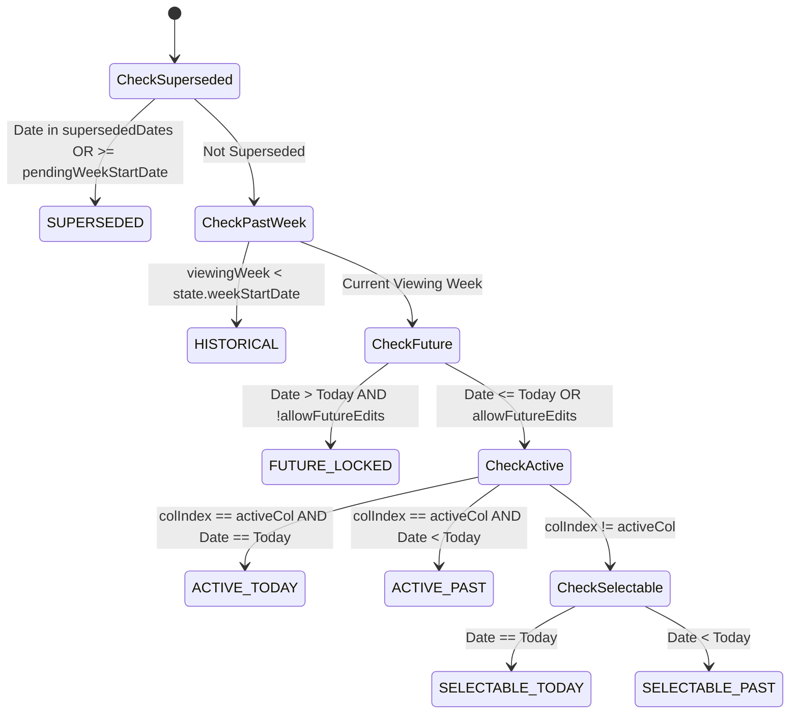

# 🏗️ Refactoring Plan: Centralized Column State Machine

**Role**: Senior Staff Software Engineer (L7/L8) Review & Architectural Specification  
**Document**: Consolidated Column State Refactoring Plan  
**Target Files**: `date_utils.js`, `app.js`, `style.css`, `tests.js`  
**Status**: Approved for Implementation  

---

## 1. Problem Statement & Root Cause Analysis

Every time a new temporal or interaction feature is introduced (e.g., Adaptive Week Start, Scenario 10 Exception Toggling, Historical Weeks, Back-to-Today quick pill), bugs repeatedly emerge across four critical areas:
1. **Header Colors & Hover States** (e.g., future day headers falling back to blue or past headers miscoloring).
2. **Header & Cell Interactability** (e.g., future exceptions erroneously blocked in Exception Mode, or past weeks allowing active day switching).
3. **Column & Cell Patterning** (e.g., diagonal stripe hatching missing on excused or superseded Pokéballs).
4. **Tooltips** (e.g., "These days moved to your new chart! 🚀" tooltip missing or erroneously attached).

### Why this happens today:
* **5 Independent Derivation Sites**: `updateActiveColumnUI()`, `renderGridTable()`, `handleCheckboxChange()`, `handleGridClick()`, and the Header Click Listener each independently re-derive date math, week start offsets, superseded intervals, and future date locks.
* **Combinatorial CSS Specificity Wars**: CSS relies on fragile negative selectors (e.g., `.day-header.future-day-header:not(.superseded-header)`) scattered across disparate sections (`style.css:648` and `style.css:2084`).
* **Conflated Action Permissions**: The existing codebase conflates *"Can a child check this box today?"* with *"Can a parent configure an exception?"* and *"Can the user switch the active column?"*.

---

## 2. Senior Staff Evaluation of Initial Proposals

A thorough audit of the draft proposals revealed **7 critical gaps and logic flaws**:

| # | Flaw in Draft Proposal | Impact / Regression Risk | Senior Staff Architectural Solution |
|---|---|---|---|
| 1 | **State Hierarchy Inversion** (`isPastWeek` evaluated before `isSuperseded`) | Historical weeks with truncated days would lose the required diagonal stripe forward-hatching and tooltip. | `SUPERSEDED` is given highest priority over `HISTORICAL`. |
| 2 | **Column vs Cell State Conflation** (Putting `out-of-range` in column state) | `isOutOfRange` depends on individual task `createdAt`/`deletedAt`, not the entire column. | Remove `out-of-range` from column state; keep task range checks strictly inside task-row loops. |
| 3 | **Binary Action Conflation** (Using single `isClickable`/`isEditable`) | **Breaks Scenario 10**: Parent cannot toggle exceptions on future days if future days are marked unclickable. | Provide decoupled capabilities: `canSelectHeader`, `requiresSwitchConfirmation`, `canCheckTaskNormal`, `canToggleException`. |
| 4 | **Semantic Misclassification** (Calling Today `past-switchable` when inactive) | Switching back to Today has 0 friction, whereas switching to a past day requires a confirmation modal. | Distinguish `SELECTABLE_TODAY` (frictionless) from `SELECTABLE_PAST` (confirmation modal). |
| 5 | **O(N) Recalculation Performance** (Calling `getColumnState` 7 times in isolation) | Redundant `getHistoricalWeekIntervals()` and date parsing in per-cell and per-header loops. | Implement `getWeekColumnStates()` to compute week context once and return an array of 7 column states. |
| 6 | **DOM Class Inspection in Event Handlers** (`th.classList.contains(...)`) | Fragile event handling coupled to CSS classes rather than source-of-truth state. | Handlers query `getColumnState(colIndex)` directly. |
| 7 | **Fragile CSS Class Toggling** (Prone to missing class removals) | Specificity collisions and stale class combinations. | Pair class assignment with a declarative `data-column-state` attribute. |

---

## 3. Formal Finite State Machine (FSM)



### State & Capability Matrix

| State Identifier | `canSelectHeader` | `requiresModal` | `canCheckTaskNormal` | `canToggleException` | Header Visual Style | Cell Visual Style |
|---|:---:|:---:|:---:|:---:|---|---|
| `SUPERSEDED` | ❌ False | N/A | ❌ False | ❌ False | Diagonal Stripe Hatching, Grey Text (`#475569`), `not-allowed` | Diagonal Stripe Hatching, `not-allowed` |
| `HISTORICAL` | ❌ False | N/A | ❌ False | ❌ False | Neutral Grey (`#cbd5e1`), Slate Text, `not-allowed` | Dimmed (0.4 opacity), read-only |
| `FUTURE_LOCKED` | ❌ False | N/A | ❌ False | ✅ **True** *(Scenario 10)* | Muted Grey (`#cbd5e1`), Slate Text, `not-allowed` | Dimmed, check disabled, exception clickable |
| `ACTIVE_TODAY` | ❌ False *(Selected)* | N/A | ✅ True | ✅ True | Bright Yellow (`var(--poke-yellow)`), Dark Text | Full Opacity (1.0), Interactive |
| `ACTIVE_PAST` | ❌ False *(Selected)* | N/A | ✅ True | ✅ True | Bright Yellow (`var(--poke-yellow)`), Dark Text | Full Opacity (1.0), Interactive |
| `SELECTABLE_TODAY` | ✅ True | ❌ False *(Frictionless)* | ❌ False | ✅ True | Default Poké Blue (`var(--poke-blue)`), Pointer | Dimmed (0.4 opacity), Click header/pill to select |
| `SELECTABLE_PAST` | ✅ True | ✅ True *(Confirm modal)* | ❌ False | ✅ True | Default Poké Blue (`var(--poke-blue)`), Pointer | Dimmed (0.4 opacity), Click header to switch |

---

## 4. Technical Specification

### 4.1 Pure State Derivation (`date_utils.js`)

```javascript
/**
 * Resolves all 7 column states for a given week in a single optimized pass.
 * Single source of truth for header styling, cell rendering, and interaction gating.
 *
 * @param {Object} state - Current global application state
 * @param {string} [viewingWeekStartDate] - 'YYYY-MM-DD' of the currently viewed week
 * @returns {Array<Object>} Array of 7 resolved column state objects
 */
export function getWeekColumnStates(state, viewingWeekStartDate = null) {
  const currentViewWeek = viewingWeekStartDate || state.weekStartDate;
  const isPastWeek = !!(state.weekStartDate && currentViewWeek < state.weekStartDate);
  
  const intervals = getHistoricalWeekIntervals(state, currentViewWeek);
  const currentInterval = intervals.find(i => i.startDate === currentViewWeek) || null;
  const viewingStartDay = currentInterval ? currentInterval.weekStartDay : (state.weekStartDay ?? 0);
  
  const localDateObj = getLocalDate(state?.timezoneOffset);
  const todayStr = formatLocalDate(localDateObj);
  const allowFutureEdits = areFutureEditsAllowed();
  
  const activeDay = state.activeDay !== undefined ? state.activeDay : -1;
  const activeColumn = (isPastWeek || activeDay === -1) 
    ? -1 
    : (activeDay - viewingStartDay + 7) % 7;

  const columns = [];

  for (let colIndex = 0; colIndex < 7; colIndex++) {
    const dateStr = getDateOfColumn(currentViewWeek, colIndex);
    const dayOfWeek = (viewingStartDay + colIndex) % 7;
    
    const isSupersededInHistory = !!(currentInterval?.supersededDates?.includes(dateStr));
    const isPendingLocked = !!(!isPastWeek && state.pendingWeekStartDate && dateStr >= state.pendingWeekStartDate);
    const isSuperseded = isSupersededInHistory || isPendingLocked;
    const isFutureDay = dateStr > todayStr;
    const isToday = (dateStr === todayStr);
    const isActive = (colIndex === activeColumn && !isPastWeek);

    let stateKey = '';
    let headerClass = '';
    let cellClass = '';
    let tooltip = '';
    let canSelectHeader = false;
    let requiresSwitchConfirmation = false;
    let canCheckTaskNormal = false;
    let canToggleException = false;

    // Strict Precedence Order
    if (isSuperseded) {
      stateKey = 'SUPERSEDED';
      headerClass = 'superseded-header';
      cellClass = 'superseded-cell';
      tooltip = 'These days moved to your new chart! 🚀';
      canSelectHeader = false;
      requiresSwitchConfirmation = false;
      canCheckTaskNormal = false;
      canToggleException = false;
    } else if (isPastWeek) {
      stateKey = 'HISTORICAL';
      headerClass = 'past-week-header';
      cellClass = 'historical-cell';
      tooltip = '';
      canSelectHeader = false;
      requiresSwitchConfirmation = false;
      canCheckTaskNormal = false;
      canToggleException = false;
    } else if (isFutureDay && !allowFutureEdits) {
      stateKey = 'FUTURE_LOCKED';
      headerClass = 'future-day-header';
      cellClass = 'future-cell';
      tooltip = '';
      canSelectHeader = false;
      requiresSwitchConfirmation = false;
      canCheckTaskNormal = false;
      canToggleException = true; // Scenario 10: Parent can configure exceptions on future days
    } else if (isActive) {
      stateKey = isToday ? 'ACTIVE_TODAY' : 'ACTIVE_PAST';
      headerClass = 'active-day';
      cellClass = 'active-column';
      tooltip = '';
      canSelectHeader = false;
      requiresSwitchConfirmation = false;
      canCheckTaskNormal = true;
      canToggleException = true;
    } else if (isToday) {
      stateKey = 'SELECTABLE_TODAY';
      headerClass = '';
      cellClass = '';
      tooltip = '';
      canSelectHeader = true;
      requiresSwitchConfirmation = false;
      canCheckTaskNormal = false;
      canToggleException = true;
    } else {
      stateKey = 'SELECTABLE_PAST';
      headerClass = '';
      cellClass = '';
      tooltip = '';
      canSelectHeader = true;
      requiresSwitchConfirmation = true;
      canCheckTaskNormal = false;
      canToggleException = true;
    }

    columns.push({
      columnIndex: colIndex,
      dayOfWeek,
      dateStr,
      state: stateKey,
      headerClass,
      cellClass,
      tooltip,
      canSelectHeader,
      requiresSwitchConfirmation,
      canCheckTaskNormal,
      canToggleException,
      isCellDisabled: !canCheckTaskNormal
    });
  }

  return columns;
}

export function getColumnState(colIndex, state, viewingWeekStartDate = null) {
  const all = getWeekColumnStates(state, viewingWeekStartDate);
  return all[colIndex] || null;
}
```

### 4.2 Consumer Refactoring in `app.js`

1. **`updateActiveColumnUI()`**: Clears all header classes and adds only `col.headerClass` + `th.dataset.columnState = col.state.toLowerCase()`. Sets `th.title = col.tooltip` and cursor.
2. **`renderGridTable()`**: Retrieves `colStates = getWeekColumnStates(...)` before the loop. Uses `col.cellClass`, `col.tooltip`, `col.isCellDisabled` inside task checkbox rendering.
3. **Header Click Handler**: Replaces multi-line guards with `if (!col.canSelectHeader) return;`. Evaluates `col.requiresSwitchConfirmation` to show the modal or switch directly.
4. **Exception Mode Handler (`handleGridClick`)**: Replaces guards with `if (!col.canToggleException) return;`.
5. **Normal Mode Checkbox Change (`handleCheckboxChange`)**: Uses `col.canCheckTaskNormal` to allow immediate toggle, or `col.canSelectHeader` to trigger day switch confirmation.

### 4.3 Consolidated CSS in `style.css`

```css
/* ==========================================================================
   COLUMN STATE MACHINE STYLES
   Single source of truth driven by getWeekColumnStates()
   ========================================================================== */

/* Base Header Style */
.day-header {
  cursor: pointer;
  background-color: var(--poke-blue);
  color: white;
  transition: background-color 0.2s, color 0.2s;
}
.day-header:hover {
  background-color: rgba(255, 255, 255, 0.15);
}

/* 1. SUPERSEDED (Forward-hashed dates) - Highest Precedence */
.day-header.superseded-header,
.day-header[data-column-state="superseded"] {
  opacity: 0.5 !important;
  background: repeating-linear-gradient(
    -45deg,
    #cbd5e1,
    #cbd5e1 6px,
    #94a3b8 6px,
    #94a3b8 12px
  ) !important;
  color: #475569 !important;
  cursor: not-allowed !important;
}

/* 2. HISTORICAL (Past week completed days) */
.day-header.past-week-header,
.day-header[data-column-state="historical"] {
  cursor: not-allowed !important;
  opacity: 0.6;
  background-color: #cbd5e1 !important;
  color: #64748b !important;
  text-shadow: none !important;
}

/* 3. FUTURE LOCKED (Upcoming days in current week) */
.day-header.future-day-header,
.day-header[data-column-state="future_locked"] {
  cursor: not-allowed !important;
  background-color: #cbd5e1 !important;
  color: #64748b !important;
  text-shadow: none !important;
  opacity: 0.85;
}

/* 4. ACTIVE (Currently selected column for entry) */
.day-header.active-day,
.day-header[data-column-state="active_today"],
.day-header[data-column-state="active_past"] {
  background-color: var(--poke-yellow) !important;
  color: var(--text-color) !important;
  text-shadow: none !important;
  cursor: default !important;
}
.day-header.active-day:hover,
.day-header[data-column-state="active_today"]:hover,
.day-header[data-column-state="active_past"]:hover {
  background-color: #e5b600 !important;
}

/* Non-active column dimming in normal training mode */
.weekly-grid td.checkbox-cell:not(.active-column),
.weekly-grid td.day-total-cell:not(.active-column) {
  opacity: 0.4;
  background-color: rgba(241, 245, 249, 0.4);
  pointer-events: none;
}

/* Exception Mode overrides */
.exception-mode .weekly-grid td.checkbox-cell {
  pointer-events: auto !important;
  opacity: 1 !important;
}
.exception-mode .weekly-grid td.checkbox-cell.superseded-cell {
  pointer-events: none !important;
  opacity: 0.55 !important;
}
```

---

## 5. Migration & Verification Strategy

1. **Zero Breaking Changes**: The refactoring preserves all existing UI contracts, styling classes, and test assertions.
2. **Dedicated FSM Unit Tests**: Add explicit unit tests covering all 7 states, both modes (normal vs exception), and edge cases (past weeks, mid-cycle shifts, sandbox mode).
3. **Headless Regression Verification**: Verify 100% pass across all 65 existing tests via `node run_headless_tests.js`.
