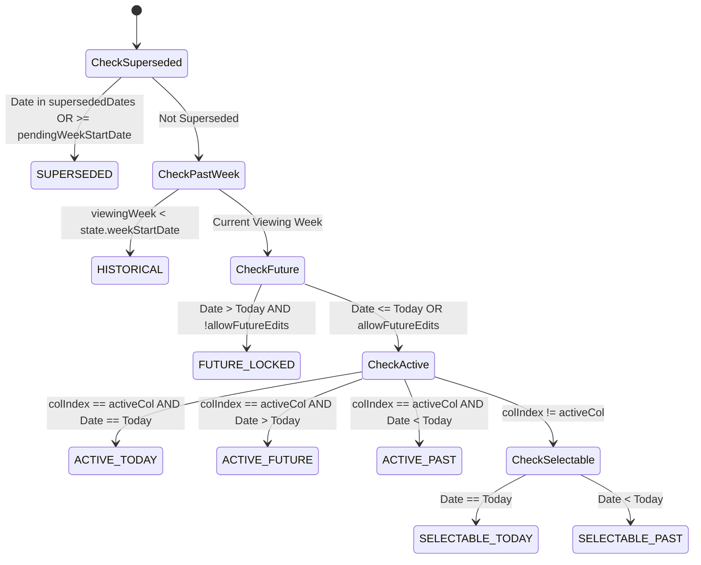

# PRD: Centralized Column State Machine & Visual Hierarchy

**Document**: `docs/prd_column_state_machine.md`  
**Version**: 1.0.0  
**Status**: Approved for Implementation  
**Audience**: Engineering, UX Design, Parent Administrators  
**Companion Standard**: [`_agents/rules/ux-guidelines.md`](file:///usr/local/google/home/crsjain/kepler-pokemon-chart/_agents/rules/ux-guidelines.md) (Section 13)  

---

## 1. Background & Problem Statement

In the Kepler Pokémon Chart, the weekly grid represents a dynamic 7-day training schedule that must gracefully accommodate several complex temporal features:
* **Real-time Day Progression**: Moving through the active week as calendar days advance.
* **Retroactive Day Switching**: Allowing kids or parents to select a past day in the week to review or complete missed activities.
* **Zero-Friction "Back to Today"**: Instantly jumping back to the actual calendar day without confirmation prompts.
* **Parent Exception Mode (Scenario 10)**: Allowing parents to toggle sick-day / travel passes on both past and future days in the active week.
* **Adaptive Week Starts (Case A / Case B)**: Forward-hashing truncated days with diagonal stripes when mid-cycle week start shifts occur.
* **Historical Week Browsing**: Exploring past archived weeks in a read-only state while preserving earned badges and stars.

### The Problem
Previously, column state, header colors, hover behavior, click gating, diagonal hatching patterns, and tooltips were calculated independently across **5+ distinct locations** in [`app.js`](file:///usr/local/google/home/crsjain/kepler-pokemon-chart/app.js) with styling split across disjoint sections of [`style.css`](file:///usr/local/google/home/crsjain/kepler-pokemon-chart/style.css). Whenever a new feature touched the calendar, subtle regressions repeatedly emerged due to overlapping booleans, state precedence inversions, and CSS specificity conflicts.

---

## 2. Product Architecture & Finite State Machine

The solution introduces a **Pure Functional Column State Machine**: `getWeekColumnStates(state, viewingWeekStartDate, options)`.

It computes all 7 column states in a single $O(1)$ pass per render, returning an array of 7 immutable column descriptor objects.



### 2.1 The 8 Formal Column States

| # | State Identifier | Temporal / Business Condition | Primary User Meaning |
|---|---|---|---|
| 1 | **`SUPERSEDED`** | Date is forward-hashed in history or `>= pendingWeekStartDate` | These days moved forward to a new week cycle. Locked across all modes. |
| 2 | **`HISTORICAL`** | Current viewing week `< state.weekStartDate` (Past Week) | A completed training week in the history archive. Read-only. |
| 3 | **`FUTURE_LOCKED`** | `dateStr > todayStr` and `!allowFutureEdits` in active week | Upcoming days locked for kids, but open for Parent Exception toggling. |
| 4 | **`ACTIVE_TODAY`** | `colIndex === activeColumn` AND `dateStr === todayStr` | Today's active training column. Full interactivity. |
| 5 | **`ACTIVE_PAST`** | `colIndex === activeColumn` AND `dateStr < todayStr` | Retroactively selected past day for task review/checking. |
| 6 | **`ACTIVE_FUTURE`** | `colIndex === activeColumn` AND `dateStr > todayStr` (Sandbox/Test) | Actively selected future day in developer sandbox / test mode. |
| 7 | **`SELECTABLE_TODAY`** | `colIndex !== activeColumn` AND `dateStr === todayStr` | Today's column when user is viewing a past day. Jump back with 0 friction. |
| 8 | **`SELECTABLE_PAST`** | `colIndex !== activeColumn` AND `dateStr < todayStr` | Inactive past day. Requires "Switch Day? 📅" confirmation modal to select. |

---

## 3. Decoupled Capability Matrix

To eliminate action conflation, the state machine resolves explicit, orthogonal capability booleans for every column:

| State Identifier | `canSelectHeader` | `requiresSwitchConfirmation` | `canCheckTaskNormal` | `canToggleException` | `isCellDisabled` |
|---|:---:|:---:|:---:|:---:|:---:|
| **`SUPERSEDED`** | ❌ False | N/A | ❌ False | ❌ False | ✅ True |
| **`HISTORICAL`** | ❌ False | N/A | ❌ False | ❌ False | ✅ True |
| **`FUTURE_LOCKED`** | ❌ False | N/A | ❌ False | ✅ **True** *(Scenario 10)* | ✅ True |
| **`ACTIVE_TODAY`** | ❌ False *(Selected)* | N/A | ✅ True | ✅ True | ❌ False |
| **`ACTIVE_PAST`** | ❌ False *(Selected)* | N/A | ✅ True | ✅ True | ❌ False |
| **`ACTIVE_FUTURE`** | ❌ False *(Selected)* | N/A | ✅ True | ✅ True | ❌ False |
| **`SELECTABLE_TODAY`** | ✅ True | ❌ False *(Frictionless)* | ❌ False | ✅ True | ✅ True |
| **`SELECTABLE_PAST`** | ✅ True | ✅ True *(Confirm modal)* | ❌ False | ✅ True | ✅ True |

---

## 4. State Visual Treatments & Design System

Visual styling strictly complies with [`_agents/rules/ux-guidelines.md`](file:///usr/local/google/home/crsjain/kepler-pokemon-chart/_agents/rules/ux-guidelines.md) (Section 13).

```
┌──────────────────────────────────────────────────────────────────────────────────────────┐
│                                 CHROMATIC HIERARCHY                                      │
│                                                                                          │
│   🟡 ACTIVE            🔵 SELECTABLE          ⚪ FUTURE/HISTORICAL    🏁 SUPERSEDED       │
│   Pikachu Yellow       Poké Blue              Neutral Slate Grey      Diagonal Hatch     │
│   High Focus (100%)    Interactive (0.4-1.0)  Muted / Locked (0.4)    Forward-Hashed     │
└──────────────────────────────────────────────────────────────────────────────────────────┘
```

### 4.1 Header and Cell Visual Pairings

| State Category | Header Visual Treatment | Cell Visual Treatment | Daily Total Cell Treatment |
|---|---|---|---|
| **Active Column** (`ACTIVE_*`) | **Pikachu Yellow** (`#ffcb05`)<br>• Dark Charcoal Text (`#1e293b`)<br>• Contrast Ratio 9.8:1 (AAA)<br>• `cursor: default` | **Full Opacity (1.0)**<br>• Solid White background (`#ffffff`)<br>• Interactive Pokéballs<br>• `pointer-events: auto` | Glowing ⭐ star when cleared, standard indicator when locked. Active column highlight. |
| **Selectable Inactive** (`SELECTABLE_*`) | **Poké Blue** (`#2a71d0`)<br>• Solid White Text (`#ffffff`)<br>• Hover brightness pulse<br>• `cursor: pointer` | **Soft Dimming (0.45 Opacity)**<br>• Tinted background<br>• `pointer-events: none` in normal mode | Dimmed indicator (0.45 opacity). |
| **Future Locked** (`FUTURE_LOCKED`) | **Neutral Slate Grey** (`#cbd5e1`)<br>• Slate Text (`#64748b`)<br>• `cursor: not-allowed` | **Muted Grey** (`#f1f5f9`)<br>• 0.8 Opacity on Pokéballs<br>• Checkbox input disabled | Dimmed indicator (0.45 opacity). |
| **Superseded** (`SUPERSEDED`) | **Diagonal Stripe Gradient**<br>`-45deg` `#cbd5e1` / `#94a3b8` 6px<br>• Slate Text (`#475569`)<br>• `cursor: not-allowed` | **Diagonal Stripe Hatching**<br>`-45deg` `#f8fafc` / `#e2e8f0` 6px<br>• Grayscale hatched Pokéballs<br>• Strictly non-clickable | Diagonal stripe background with muted grayscale `➖` indicator. |
| **Historical** (`HISTORICAL`) | **Neutral Slate Grey** (`#cbd5e1`)<br>• Slate Text (`#64748b`)<br>• `cursor: not-allowed` | **Read-Only Dimming (0.45)**<br>• Preserves earned checks & XP | Displays past earned stars ⭐ or locked indicators from `weeklyHistory`. |

### 4.2 Standardized Tooltip & Microcopy Standards
* **`SUPERSEDED`**: `"These days moved to your new chart! 🚀"`
* **`FUTURE_LOCKED`**: `"Locked until this day arrives! ⏳"`
* **`HISTORICAL`**: `"Archived training week 📜"`
* **`ACTIVE_*`**: `"Today's active training column ⭐"`
* **`SELECTABLE_PAST` CTA**: Primary: `"Switch to <TargetDayName>"`, Secondary: `"Stay on <CurrentActiveDayName>"`

---

## 5. Consumer Integration Specifications

All 6 consumers in [`app.js`](file:///usr/local/google/home/crsjain/kepler-pokemon-chart/app.js) are wired directly to the FSM:

1. **`updateActiveColumnUI()`**: Clears all header state classes, adds `col.headerClass`, and stamps `th.dataset.columnState = col.state.toLowerCase()`. Sets cursor and tooltip declaratively.
2. **`renderGridTable()` (Task Rows)**: Queries `colStates = getWeekColumnStates(...)` once at the top of the function. Stamps `data-column-state`, `col.cellClass`, and `col.isCellDisabled` onto `<td class="checkbox-cell">`.
3. **`renderGridTable()` (Daily Total Row)**: Stamps `col.state.toLowerCase()`, `col.tooltip`, and `.superseded-total` directly from `colStates[d]`.
4. **Header Click Handler**: Guards on `if (!col.canSelectHeader) return;`. Uses `col.requiresSwitchConfirmation` to determine whether to prompt modal or switch immediately.
5. **Parent Exception Mode (`handleGridClick`)**: Guards on `if (!col.canToggleException) return;`. Allows future non-superseded days (Scenario 10) while strictly locking superseded/historical days.
6. **Normal Checkbox Toggle (`handleCheckboxChange`)**: Uses `col.canCheckTaskNormal` for immediate checks; uses `col.canSelectHeader` to invoke the switch-day confirmation modal.
7. **Back-to-Today Quick Pill (`#back-to-today-btn`)**: Automatically visible when `colStates.some(c => c.state === 'ACTIVE_PAST' || c.state === 'ACTIVE_FUTURE')`.

---

## 6. Edge Case Protections & Invariants

* **Node.js Environment Purity**: `getWeekColumnStates(state, viewingWeekStartDate, options)` accepts `{ allowFutureEdits }` without hard dependency on browser `window`/`location`, allowing headless CLI tests to run cleanly.
* **DST and Timezone Skew**: Date calculation delegates strictly to `getDateOfColumn()` using `baseDate.setDate()`, preventing ±1 day drift during Daylight Saving Time 23h/25h transitions.
* **Task Lifecycle Decoupling**: Task `createdAt`/`deletedAt` checks remain strictly local to task-row rendering (`isOutOfRange`), completely decoupled from the temporal column state machine.
* **Multi-Shift Week Rollover**: When navigating past weeks with historical custom `weekStartDay`, `getWeekColumnStates` dynamically adapts to `historyEntry.weekStartDay`.

---

## 7. Verification & Regression Testing

* **Unit Testing**: Add comprehensive unit tests in [`tests.js`](file:///usr/local/google/home/crsjain/kepler-pokemon-chart/tests.js) testing all 8 states, transitions, capability booleans, and boundary conditions.
* **Headless Regression Run**: All 65/65 existing tests in `node run_headless_tests.js` must pass with 100% success before and after migration.
* **Manual Verification Checklist**:
  1. Active today is Pikachu Yellow with dark charcoal text.
  2. Future days show neutral grey headers and soft grey cells (disabled in normal mode, clickable in Exception mode).
  3. Truncated mid-cycle shifts display diagonal stripe hatching on headers, cells, and total rows with rocket tooltip.
  4. Switching to past day shows yellow active highlight on past day, blue selectable on today, and displays `⚡ Back to Today (<DayName>)` pill.
  5. Tapping `⚡ Back to Today` returns instantly with zero confirmation modal.
