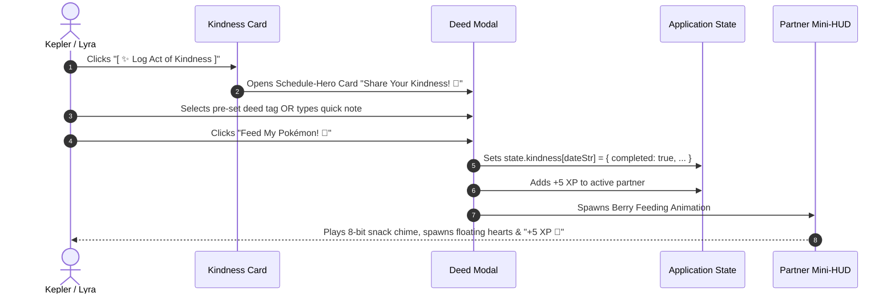

# Product Requirement Document (PRD): Kindness Quests & Partner Berry Feeding

**Document**: `docs/prd_kindness_quests.md`  
**Status**: Draft for Review / Ready for Implementation  
**Audience**: Product Management, Game Design, Engineering, Parent Administrators  
**Target Audience**: Kepler (7yo), Lyra, and Parents  
**Companion Standards**: [`docs/prd_star_vault.md`](file:///usr/local/google/home/crsjain/kepler-pokemon-chart/docs/prd_star_vault.md), [`_agents/rules/ux-guidelines.md`](file:///usr/local/google/home/crsjain/kepler-pokemon-chart/_agents/rules/ux-guidelines.md)  

---

## 1. Executive Summary & Problem Statement

### 1.1. Context & User Need
In the Kepler Pokémon Chart, children track 5 core academic/skill routines (Piano, Math, Reading, Writing, Chinese) across a 7-day schedule. Recently, children have developed an appetite for extra gameplay interactions ("Bonus Balls") beyond their daily core chores. When parents explain that grid exceptions are strictly reserved for travel or schedule disruptions, children feel a sense of artificial limitation because their desire for extra positive engagement with their Pokémon partner is unmet.

Furthermore, parents lack a lightweight, gamified positive-reinforcement mechanism for **prosocial behaviors** (kindness, empathy, sibling collaboration, unprompted tidying, table manners) that should **never** be turned into mandatory daily chores on the rigid grid.

### 1.2. The Solution: "Kindness Quests & Berry Treats"
We introduce **Kindness Quests & Berry Feeding**:
1. **Auxiliary Prosocial Side-Quest**: A dedicated, non-intrusive card below the Weekly Grid offering an optional daily kindness prompt (e.g., *"Help a family member with a chore"*, *"Give a genuine compliment"*, *"Share a favorite toy"*).
2. **The "Berry Treat" Positive Reinforcement Loop**: When a child performs an act of kindness, parents or kids can log it to receive a **Pokémon Berry 🍓** (Razz Berry, Nanab Berry, Golden Pinap Berry).
3. **Partner Feeding Interaction**: Children feed the berry to their active Pokémon partner in the Partner HUD, triggering a joyful heart-burst animation, a customized 8-bit eating chime, and a modest `+5 XP` boost.
4. **Strict Decoupling from Core Chart**: Kindness Quests are **100% independent** from the Daily Star Vault (5/5 tasks) and Weekly Badge requirements. They satisfy the child's hunger for bonus play without distorting chore incentives.

```
┌─────────────────────────────────────────────────────────────────────────────┐
│                            CORE GAMEPLAY SEPARATION                         │
├──────────────────────────────────────┬──────────────────────────────────────┤
│  ACADEMIC GRID (Daily 5 Tasks)       │  KINDNESS QUESTS (Optional Bonus)    │
│  • Piano, Math, Reading, Writing...  │  • Daily prosocial deed / kindness   │
│  • Required for Daily Star (Vault)   │  • Unlocks 1 Daily Berry Snack 🍓    │
│  • Required for Weekly Badge         │  • Feeds Partner for Joy & +5 XP     │
│  • Rigid, disciplined consistency    │  • 100% Optional, zero chore pressure│
└──────────────────────────────────────┴──────────────────────────────────────┘
```

---

## 2. Core Behavioral & Game Design Invariants

1. **Zero Chore Cannibalization**: Completing a Kindness Quest **never** substitutes or excuses an incomplete academic task (Math, Piano, etc.). A child cannot skip math and "make up for it" with a kindness berry.
2. **Zero Deficit / No Punishment**: If a child does not complete a Kindness Quest on any given day, there is **zero penalty**, no broken streak, and no visual red mark.
3. **Daily Cap Rate-Limiting**: Strictly capped at **1 Kindness Berry per day** (with an optional Parent-Only "Super Star Deed" for 2 max). This prevents XP runaway inflation and maintains partner evolution prestige.
4. **Intrinsically Motivated Framing**: Framed as caring for and bonding with their partner Pokémon, fostering empathy and altruism.

---

## 3. Detailed Feature Specifications

### 3.1. Main Tracker Screen: Kindness Quest Mini-Card
Located directly beneath the Weekly Grid table and above the Bottom Action Bar.

```
┌─────────────────────────────────────────────────────────────────────────────┐
│ 💖 DAILY KINDNESS QUEST                                        [ 🍓 0 / 1 ] │
│ ─────────────────────────────────────────────────────────────────────────── │
│ 🌟 Today's Idea: "Help clean up a room or give someone a big hug!"          │
│                                                                             │
│ [ ✨ Log Act of Kindness ]                   [ 🔄 New Idea ] [ 🔒 Parent ]  │
└─────────────────────────────────────────────────────────────────────────────┘
```

* **Visual Design**:
  - Soft candy-pink to lavender gradient (`linear-gradient(135deg, #fdf2f8, #f5f3ff)`), crisp 2px pixelated border (`#f472b6`).
  - Font: `Fredoka One` for header, `Quicksand` for body copy.
* **Dynamic Daily Idea Generator**:
  - Rotates through a curated list of ~30 age-appropriate kindness prompts for 7-year-olds (e.g., *"Say thank you to mom or dad for making food"*, *"Read a book to your sibling"*, *"Put away 5 toys without being asked"*).
  - Clicking `[ 🔄 New Idea ]` shuffles to a different prompt.
* **Action Buttons**:
  - **`[ ✨ Log Act of Kindness ]`**: Opens the Kindness Deed Logger modal.
  - **`[ 🔒 Parent Instant Award ]`**: Requires Parent PIN (`"zxcv"`) or quick tap in Admin Mode to instantly grant a berry.

---

### 3.2. Logging & Earning Flow (CUJ 1: Child Logs Deed)



1. **Deed Selection Modal**:
   - Uses standard `.schedule-hero-card` modal structure.
   - Quick-pick chips:
     - 🧸 *Helped clean up toys*
     - 🤝 *Shared with sibling*
     - 💬 *Used polite words & said thank you*
     - 🫂 *Cheered someone up*
     - ✏️ *Other super deed!*
2. **Completion Celebration**:
   - The Kindness Card transitions to an active state:
     - Badge shows: `[ 🍓 Berry Fed! ]` with a sparkling gold checkmark.
     - Text: *"Your Pokémon partner is full and super happy! 💖"*

---

### 3.3. Partner Feeding Animation & Audio Experience (CUJ 2)

When the berry is fed to the active partner:
1. **Visual Swarm**: A floating berry icon (`🍓` / `🍌` / `🍍`) flies smoothly from the modal/card directly into the Partner Mini-HUD avatar.
2. **Partner Reaction**:
   - The Pokémon partner sprite executes a quick joyful jump animation (`@keyframes partner-cheer { 0% { transform: translateY(0); } 50% { transform: translateY(-12px) rotate(5deg); } 100% { transform: translateY(0); } }`).
   - 6–8 heart particles (`💖`, `💕`, `✨`) burst outwards around the partner.
3. **Audio Feedback**:
   - Plays a custom 8-bit feeding jingle (soft ascending glissando + chime via Web Audio API).
4. **HUD Floating XP**:
   - Floats: `+5 XP 💖 KINDNESS BONUS!`.
   - Partner XP bar fills smoothly. If leveling up occurs, triggers standard Level Up Fanfare!

---

### 3.4. Parent Admin Control & History (Admin Panel Tab)

Located within the existing Admin Modal (`"zxcv"`):
* **Toggle Setting**: `Enable Kindness Quests` (Default: `true`).
* **Custom Prompts Editor**: Parents can add family-specific kindness goals (e.g., *"Practice sharing the Nintendo Switch"*, *"Feed the family pet"*).
* **Weekly Kindness Ledger**: View past days where kindness berries were awarded.
* **Instant Award Button**: Single-click button allowing parents to quietly bestow a berry after witnessing great behavior.

---

## 4. Technical Architecture & Schema Migration (V19)

### 4.1. Application State Schema (`state.js`)
We increment state schema to **Version 19**:

```javascript
{
  // ... existing V18 schema (partnersData, starVault, weeklyHistory, etc.)
  schemaVersion: 19,
  kindnessQuests: {
    // Key format: "YYYY-MM-DD"
    "2026-08-31": {
      completed: true,
      deed: "Helped clean up toys without being asked",
      category: "helping",
      berryType: "razz", // 'razz' (+5 XP), 'golden' (+10 XP parent special)
      xpAwarded: 5,
      timestamp: 1788156000000
    }
  },
  customKindnessPrompts: [] // Optional parent-configured prompt strings
}
```

### 4.2. Migration Implementation (`migrations.js`)
* **V18 -> V19**:
  - Initializes `state.kindnessQuests = {}` if missing.
  - Initializes `state.customKindnessPrompts = []` if missing.
  - Schema version updated to `19`.

### 4.3. Date Keying & Historical Isolation
* Kindness records are strictly date-keyed (`YYYY-MM-DD`).
* Resetting the weekly grid (`resetWeekGrid`) or changing the week start day does **NOT** delete historical kindness records.
* In Historical Week views (`◀ Prev`), the kindness card displays the read-only deed logged for the selected day in that past week.

---

## 5. UI/UX Rules & Accessibility Guardrails

1. **No Modal Blocking**: The kindness card never blocks task completion or week navigation.
2. **Strict Modal Standards**: Any modal opened for kindness logging must follow [`_agents/rules/ux-guidelines.md`](file:///usr/local/google/home/crsjain/kepler-pokemon-chart/_agents/rules/ux-guidelines.md):
   - `.schedule-hero-card` header.
   - `.pixel-btn.info` (Pink/Purple primary action) and `.pixel-btn.greyed-out` for Cancel.
   - Zero native `window.alert()` or `window.prompt()`.
3. **Screen Size Responsive**:
   - Desktop (> 900px): Sits elegantly beneath the split-view grid.
   - Tablet / Mobile (< 768px): Stacks compactly with full-width tap targets (> 48px touch targets).

---

## 6. Success Metrics & Test Scenarios

### 6.1. Success Metrics
* **Sibling Peace Metric**: Zero whining or lobbying for "fake bonus balls" during chore time.
* **Prosocial Habit Reinforcement**: >= 4 kindness deeds logged per week per child.
* **Zero Core Cannibalization**: Academic chore completion rate remains >= 95%.

### 6.2. Headless Regression Test Suite Scenarios
The following automated test cases will be added to `tests.js`:
* **Test Case A (Kindness Card Rendering)**: Verifies kindness card exists in DOM with rotating prompt.
* **Test Case B (Logging Deed & XP Emission)**: Simulates clicking deed chip, verifies `state.kindnessQuests[today]` is saved, verifies active partner receives exactly `+5 XP`.
* **Test Case C (Daily Rate Limit)**: Verifies that after 1 berry is logged for today, the button enters completed/disabled state preventing duplicate XP farming.
* **Test Case D (Historical & Date Switching)**: Navigating to past days reflects past kindness deeds without modifying current day status.
* **Test Case E (Full Regression)**: All 67 existing test cases pass 100% alongside new kindness tests.

---

## 7. Implementation Plan

| Milestone | Deliverables | Target Timeline |
| :--- | :--- | :--- |
| **Phase 1: State & Migrations** | Update `state.js` to V19 schema, add migration in `migrations.js`, register default prompt pool. | Day 1 |
| **Phase 2: UI Component & Card** | Implement `.kindness-quest-card` in `index.html` and `style.css` matching Pokemon aesthetics. | Day 1 |
| **Phase 3: Deed Modal & Partner Feeding** | Wire modal in `app.js`, add berry eating sound effect & heart particle animations in `CelebrationEngine`. | Day 2 |
| **Phase 4: Admin Controls & History** | Add parent management in Admin modal, add automated test suite coverage in `tests.js`. | Day 2 |
